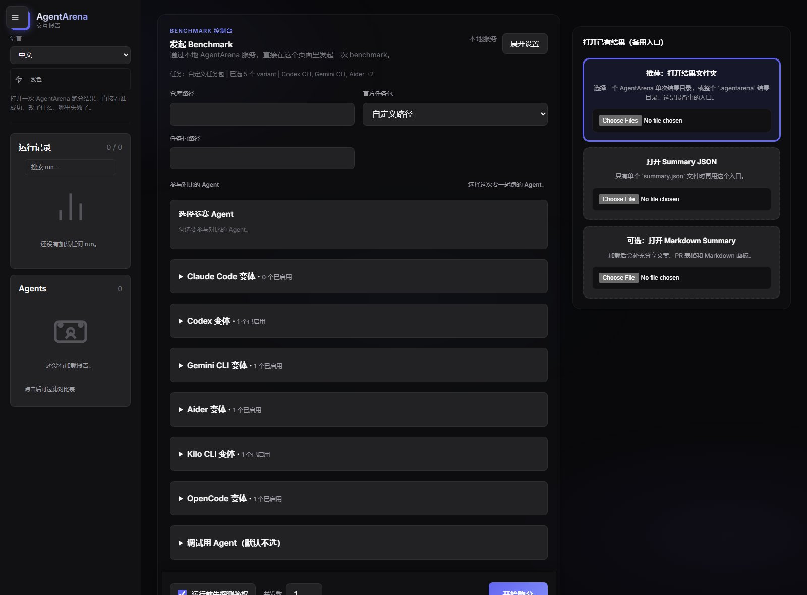
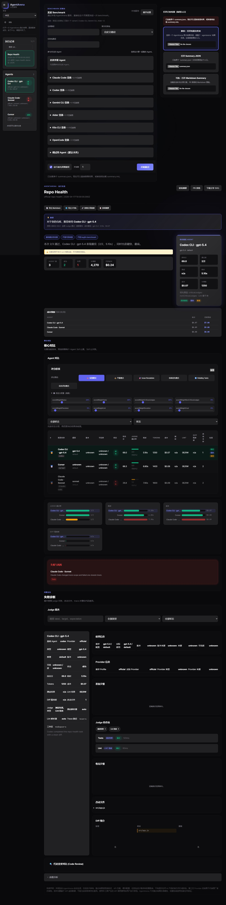

# AgentArena

> Benchmark the coding agents you already run locally on the same repo, the same task, and the same judges.

[中文说明](./README.zh-CN.md)




AgentArena is for people who already use coding agents in real work and want something more trustworthy than vibes.

It helps answer questions like:

- How strong is my current `Codex CLI + model X` setup on real repository tasks?
- Is `Claude Code` actually better than `Cursor` for the kind of fixes I care about?
- If I only run one local agent, how do I turn that into a repeatable capability baseline instead of a gut feeling?
- When a run looks surprising, how do I inspect the diff, judge failures, and trace instead of trusting one score?

AgentArena is local-first by default. You point it at your own repository, task pack, and locally installed agent CLIs. AgentArena handles shared setup, execution, judges, traces, and reports.

See **[docs/ui-and-adapters.md](./docs/ui-and-adapters.md)** for local UI bind address & auth rules, doctor/preflight semantics, and related contract tests. Quantitative line coverage: `pnpm test:coverage` (Node `--experimental-test-coverage`).

## Quick Install

```bash
npm install -g @agentarena/cli
```

## Try It in 60 Seconds

No external agent CLI needed. The built-in demo agents work out of the box:

```bash
# Create a task pack
agentarena init-taskpack --template repo-health --output my-task.yaml

# Run with demo agents (no auth required)
agentarena run --repo . --task my-task.yaml --agents demo-fast,demo-thorough

# View the results in your browser
agentarena ui
```

Open `http://127.0.0.1:4320`, load the result from `.agentarena/runs/`, and explore the dashboard.

When you're ready to benchmark real agents, just install their CLIs and run:

```bash
agentarena run \
  --repo . \
  --task my-task.yaml \
  --agents codex,claude-code,cursor \
  --probe-auth
```

> **New to AgentArena?** See the [Getting Started Guide](./docs/getting-started.md) for a step-by-step walkthrough.
> **Running into issues?** Check the [Troubleshooting Guide](./docs/troubleshooting.md).

## How AgentArena Compares

| | SWE-bench | HumanEval | BigCodeBench | **AgentArena** |
|---|---|---|---|---|
| Runs locally | ❌ cloud only | ❌ cloud only | ❌ cloud only | **✅ fully local** |
| Your own repo | ❌ fixed repos | ❌ synthetic | ❌ synthetic | **✅ any repo** |
| Custom tasks | ❌ | ❌ | ❌ | **✅ YAML/JSON task packs** |
| Any agent CLI | ❌ SWE-agent only | ❌ | ❌ | **✅ 12+ adapters** |
| Offline capable | ❌ | ❌ | ❌ | **✅ no internet needed** |
| Built-in UI | ❌ | ❌ | ❌ | **✅ web dashboard** |
| CI integration | ❌ | ❌ | ❌ | **✅ GitHub Actions** |
| Diff + trace | ❌ | ❌ | ❌ | **✅ full audit trail** |

AgentArena is not a replacement for SWE-bench or HumanEval. It fills a different gap: **local, repeatable, agent-agnostic benchmarking on your own codebase**.

## Why This Exists

Most agent users are already past "how do I install an agent?" and into "which setup actually performs better on my work?"

AgentArena is built for that stage.

It gives you:

- a shared benchmark harness for agents you already use locally
- repeatable task packs with structured judges
- comparable outputs across both single-agent and multi-agent runs
- a browser UI that works as both launcher and report viewer
- reports you can keep, compare, share, and attach to CI

## Best Use Cases

- compare multiple local coding agents on the same repository task
- track whether one agent / model / provider combo is getting better or worse over time
- benchmark one agent repeatedly to estimate its current capability ceiling on your workflow
- run local smoke benchmarks before rolling a new agent or model out to a team
- generate HTML / Markdown / PR-comment artifacts from the same benchmark run

## What You Get From One Run

Even if you only benchmark one local agent, AgentArena is still useful. A single run gives you:

- a shared score and judge pass/fail breakdown
- changed files and diff scope signals
- duration, token usage, and cost when available
- trace output for replay and diagnosis
- comparable history once you keep running the same task over time

That means a single-agent run is not "just one score". It becomes the baseline you compare future runs against.

## What Makes The Result Credible

AgentArena is opinionated about fairness:

- same repository snapshot
- same task definition
- same setup commands
- same judge logic
- readiness checks before execution
- isolated workspaces per run
- structured report outputs after execution

If an adapter is blocked by missing auth or broken local setup, `agentarena doctor` should tell you before you trust the result.

## Current Capabilities

### Core flows

- `agentarena ui` for browser-based launch + report viewing; Workbench is the default, and `/legacy/` keeps historical links compatible
- `agentarena run` for direct CLI execution
- `agentarena doctor` for readiness and auth-aware checks
- `agentarena list-adapters` for adapter capability listing
- `agentarena init-taskpack` for starter task packs
- `agentarena init-ci` for GitHub Actions benchmark workflows

### Reliability focus

New adapter work is currently paused. The near-term focus is making existing adapters, results, and the Workbench journey more reliable. See [Product direction](./docs/product-direction.md).

### Report outputs

Every run can generate:

- `summary.json`
- `summary.md`
- `report.html`
- `pr-comment.md`
- `badge.json`

### Judge coverage

Current built-in judge types include:

- `command`
- `test-result`
- `lint-check`
- `file-exists`
- `file-contains`
- `regex-match`
- `directory-exists`
- `compilation`
- `glob`
- `file-count`
- `snapshot`
- `json-value`
- `json-schema`
- `patch-validation`
- `token-efficiency`

### Adapter coverage

| Adapter | Tier | Notes |
| --- | --- | --- |
| `codex` | supported | configurable model + reasoning effort |
| `claude-code` | experimental | auth-aware failure reporting |
| `cursor` | experimental | local bridge, auth-sensitive |
| `gemini-cli` | experimental | token and cost parsing |
| `aider` | experimental | multi-model support |
| `copilot` | experimental | token estimation |
| `qwen-code` | experimental | JSON output parsing |
| `kilo-cli` | experimental | OpenCode-based |
| `opencode` | experimental | multi-provider open source CLI |
| `trae` | experimental | event stream parsing |
| `augment` | experimental | multi-model support |
| `windsurf` | blocked | auth stability issues |
| `demo-fast` / `demo-thorough` / `demo-budget` | supported | built-in, no external setup required |

> **Tiers**: `supported` = verified standard integration path; `experimental` = usable, but sensitive to local auth, CLI flag changes, or install layout; `blocked` = intentionally not treated as stable automation today. See [Adapter Capabilities](./docs/adapter-capabilities.md) for the full capability matrix.

## Quick Start

### Path A: benchmark the local agent you already use

```bash
pnpm install
pnpm build
pnpm doctor
node packages/cli/dist/index.js ui
```

Then open the local address printed in the terminal, usually:

```text
http://127.0.0.1:4320
```

From there:

1. choose the repository you want to benchmark
2. choose a task pack
3. choose one or more local agents you already use
4. run the benchmark
5. inspect the result in the same UI

### Path B: get a single-agent baseline from the CLI

```bash
node packages/cli/dist/index.js run --repo . --task examples/taskpacks/demo-repo-health.yaml --agents codex --output .agentarena/manual-run
```

This is the simplest "how strong is my current local Codex setup?" path.

### Path C: compare multiple local agents on one task

```bash
node packages/cli/dist/index.js run --repo . --task examples/taskpacks/demo-repo-health.yaml --agents codex,claude-code,cursor --output .agentarena/manual-run
```

### Path D: fast product tour without external auth

```bash
pnpm demo
node packages/cli/dist/index.js ui
```

Use the built-in demo adapters when you want to verify the product flow before benchmarking real agents.

## Common Commands

Check local adapter readiness:

```bash
pnpm doctor
```

List adapters and capability metadata:

```bash
node packages/cli/dist/index.js list-adapters --json
```

Fail fast when one requested adapter is not ready:

```bash
node packages/cli/dist/index.js doctor --agents codex,claude-code,cursor --probe-auth --strict
```

Return machine-readable benchmark output:

```bash
node packages/cli/dist/index.js run --repo . --task examples/taskpacks/demo-repo-health.yaml --agents codex --json
```

Generate a starter YAML task pack:

```bash
node packages/cli/dist/index.js init-taskpack --template repo-health --output agentarena.taskpack.yaml
```

Generate a benchmark workflow for GitHub Actions:

```bash
node packages/cli/dist/index.js init-ci --task agentarena.taskpack.yaml --agents codex,claude-code
```

Run the browser-level web-report smoke test:

```bash
npx playwright install --with-deps chromium
pnpm test:web-report:e2e
```

## Official Task Pack Library

<!-- official-taskpacks:start -->

There are **30** official task packs. This catalog is generated directly from the task pack files.

| Task pack | Name | Purpose |
| --- | --- | --- |
| `add-error-handling` | Add Cache Validation | Add input validation and error handling to a cache function. |
| `add-feature-with-tests` | Add Feature with Tests | Add a memoization feature to a function and write tests for it. |
| `api-documentation` | API Documentation | Write documentation for an API module. |
| `bug-chain-fix` | Bug Chain Fix | Fix 3 related bugs across 3 files where each fix depends on the others. |
| `official-builtin-demo-coding` | Built-in Demo: Add Error Handling | A coding task that works out of the box — no local project needed. Uses the built-in test repository with 4 TypeScript packages. The agent must add proper error handling to a service function. |
| `official-config-repair` | Config Repair | Fix a broken configuration file to match its schema. |
| `cross-file-refactor` | Cross-File Refactor | Move a function to a new module and update all references. |
| `official-cross-module-refactor` | Official Cross-Module Refactor | Refactor a feature that spans multiple modules/packages. |
| `dependency-update` | Enhance Logger | Add log levels and context support to the logger. |
| `docker-setup` | Docker Configuration | Create or improve Docker configuration for a project. |
| `efficiency-first-example` | Efficiency First Example (CursorBench Inspired) | Demonstrates token-efficiency judge for cost-effective coding |
| `error-handling` | Create Error Classes | Create custom error class hierarchy and add input validation. |
| `failing-test-fix` | Failing Test Fix | Fix a failing test by correcting the implementation. |
| `go-microservice` | Go Microservice Feature | Add a feature to a Go microservice with proper error handling and tests. |
| `input-validation` | Add Input Validation | Add HTML sanitization and path traversal protection. |
| `issue-resolution-example` | Issue Resolution Example (SWE-Bench Inspired) | Demonstrates patch-validation judge for GitHub issue fixing |
| `iterative-debug` | Iterative Debug | Fix a bug by running tests, reading failures, and fixing iteratively. |
| `official-json-contract-repair` | JSON Contract Repair | Fix a JSON response to match its contract. |
| `logging-improvement` | Improve Logging | Add log levels and context support to the logger. |
| `multi-file-rename` | Multi-File Rename | Rename a function across multiple source files. |
| `official-performance-optimize` | Performance Optimize | Optimize utility functions for better performance. |
| `python-api` | Python API Endpoint | Implement a new REST API endpoint in a Python web application. |
| `react-bugfix` | React Component Bug Fix | Fix a bug in a React component and verify the fix with tests. |
| `refactor-with-tests` | Refactor with Tests | Refactor a function while keeping all tests passing. |
| `official-repo-health` | Official Repo Health | Fix a bug in a utility function and verify existing tests pass. |
| `rotating-tasks-2026-04-example` | Rotating Tasks Example (LiveBench Inspired) | Demonstrates anti-contamination mechanism with task rotation |
| `security-hardening` | Security Hardening | Add HTML sanitization and path traversal protection. |
| `official-small-refactor` | Official Small Refactor | Performs a low-risk refactor while keeping core repository structure intact. |
| `official-snapshot-fix` | Snapshot Fix | Fix a generator script to match its expected output. |
| `test-coverage` | Increase Test Coverage | Add tests for untested modules. |

<!-- official-taskpacks:end -->

## Repository Layout

```text
apps/
  web-report/          Interactive benchmark UI (vanilla JS, PWA)
packages/
  cli/                 CLI entry point (ui, run, doctor, init-taskpack, init-ci)
  core/                Shared types and utilities
  runner/              Benchmark orchestrator
  adapters/            Agent adapters and registry
  judges/              Judge implementations
  taskpacks/           Task pack loader and validator
  trace/               Execution trace recorder and replay helpers
  report/              Report generators (JSON, Markdown, HTML, badge)
examples/
  taskpacks/           Demo and official task packs
fixtures/
  nodejs-monorepo/     Standard test repository
docs/
```

## Documentation

- **[Getting Started](./docs/getting-started.md)** — install and run your first benchmark
- **[Troubleshooting](./docs/troubleshooting.md)** — common issues and fixes
- [Project overview](./docs/overview.md)
- [Benchmark fairness](./docs/fairness.md)
- [Adapter capabilities](./docs/adapter-capabilities.md)
- [Task pack modes](./docs/taskpack-modes.md)
- [Scoring deep dive](./docs/scoring.md)
- [HTTP API](./docs/http-api.md)
- [Web report app](./apps/web-report/README.md)
- [Runner Docker](./docs/runner-docker.md)
- [Official task packs](./examples/taskpacks/official/README.md)
- [Contributing](./CONTRIBUTING.md)
- [Changelog](./CHANGELOG.md)

## License

[MIT](./LICENSE)
